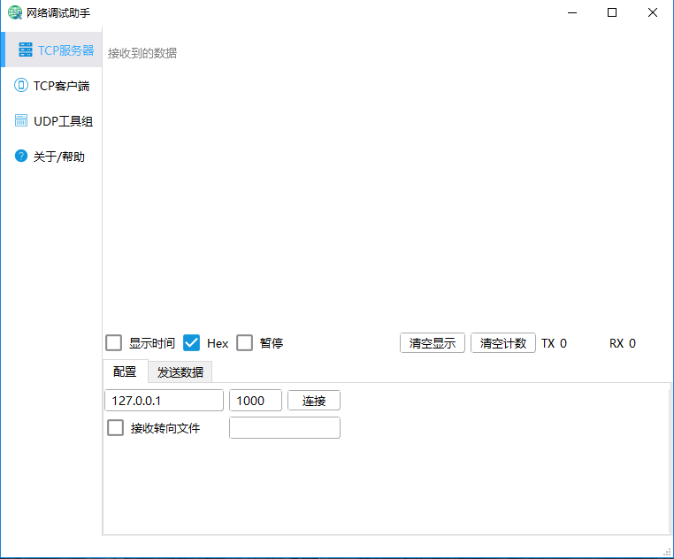

# NetDebug

#### 项目介绍

本项目使用pyqt5创建了一个网络调试助手,包含TCP/IP服务器，TCP/IP客户端，UDP/IP
服务器， UDP/IP客户端

#### 软件架构

软件架构说明:

使用Python标准库的Selector和PyQt5完成的本程序

TODO: 使用Python3的asyncio模块来完成socket操作；

#### 安装教程

克隆本项目

1. pip install pyqt5==5.10.1
2. python MainWindows.py

<h3>运行环境</h3>

windows 7以上，windows xp未测试

 
<h3>使用说明</h3>

本工具包含了TCP, UDP的服务器和客户端;

 

<h4>TCP服务器</h4>
<ol>
	<li>此TCP服务能够接收多个客户端连接，连接数量根据系统内存，CPU和带宽决定;</li>
	<li>测试电脑8G内存自发自收能够创建1024个客户端，测试hello world数据发送，50ms并发测试;</li>
	<li>支持对某个客户端返回数据;鼠标选中指定的客户端信息，就可以发送数据;</li>
	<li>支持接收的数据重定向到日志文件中;</li>
</ol>
 

<h4>TCP客户端</h4>
<ol>
	<li>默认创建一个客户端, 但修改了客户端个数后会自动保存，下次启动读取记录值;</li>
	<li>建议客户端创建数量在100以内，过多会导致消耗内存和CPU;</li>
	<li>数据发送支持单条，多条发送;</li>
	<li>支持定时发送，建议定时时间再10毫秒以上，当客户端个数多，定时时间短，则容易导致CPU繁忙;</li>
</ol>

<h4>UDP服务器</h4>
<ol>
	<li>UDP服务器同TCP服务器一样，能支持多个客户端的数据，支持的客户端数量根据电脑性能决定;</li>
	<li>支持接收数据重定向到日志中;</li>
</ol>

<h4>客户端</h4>
<ol>
	<li>同TCP客户端一样，支持创建多个客户端，数量根据电脑性能决定;</li>
	<li>建议客户端创建数量在100以内，过多会导致消耗内存和CPU;</li>
	<li>支持定时发送，建议定时时间再10毫秒以上，当客户端个数多，定时时间短，则容易导致CPU繁忙;</li>
	<li>UDP客户端需要发送数据到服务后才会显示创建的UDP客户端信息;</li>
</ol>
